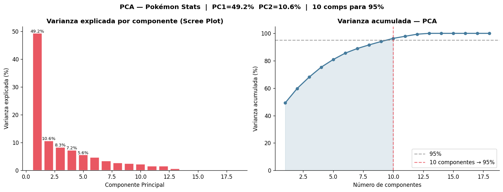
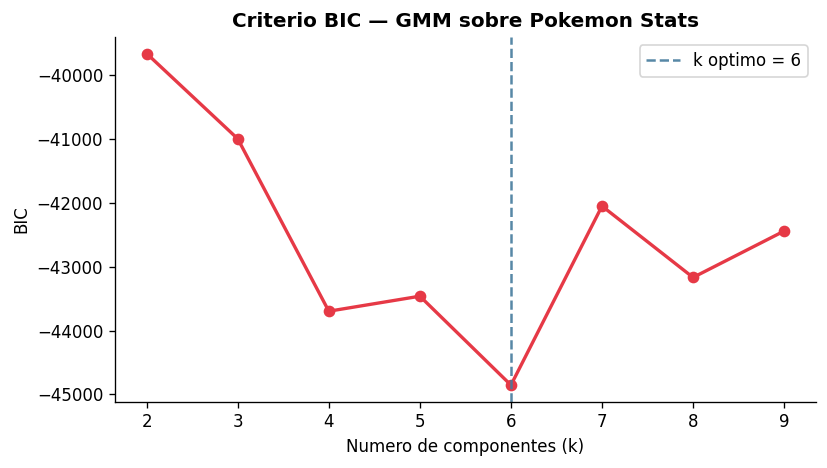
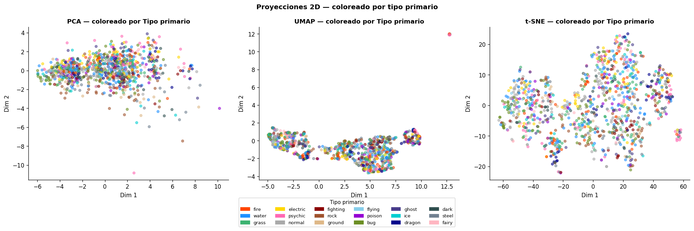
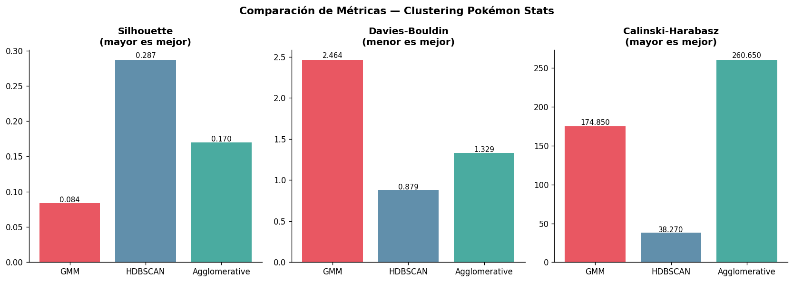
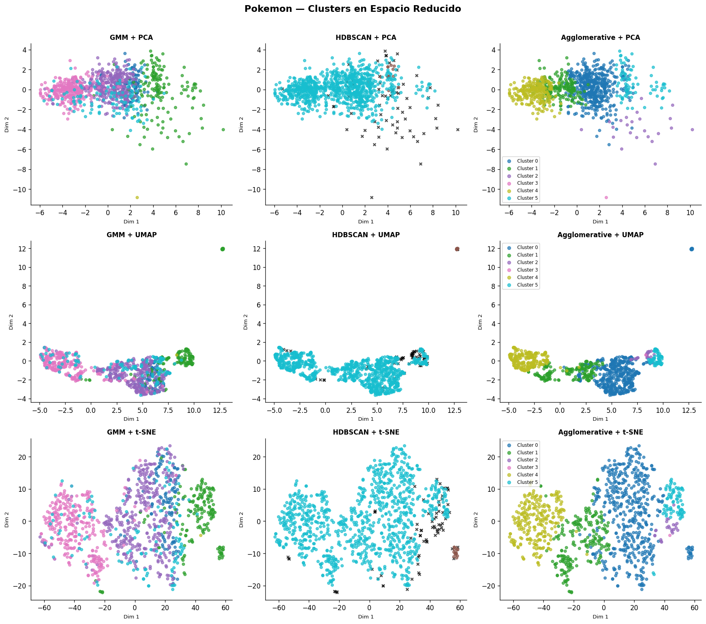

# 🎮 Pokémon Clustering — Aprendizaje No Supervisado

> **Maestría en Inteligencia Artificial · FIUNA**
> Trabajo Práctico — Módulo de Aprendizaje No Supervisado
> **Alumna:** Tatiana Caballero

[](https://colab.research.google.com/github/tatic2003/pokemon-clustering/blob/main/notebook/AprendizajeNoSupervisado_TP_Final.ipynb)
[](https://www.python.org/)
[](https://scikit-learn.org/)
[](LICENSE)

---

##Descripción

¿Puede un algoritmo de Machine Learning descubrir qué Pokémon son legendarios **sin que nadie se lo diga**?

Este proyecto aplica técnicas de **aprendizaje no supervisado** al *Ultimate Pokémon Dataset 2025* para descubrir agrupaciones naturales entre los 1025 Pokémon de todas las generaciones (I–IX), utilizando únicamente sus propiedades numéricas — estadísticas de combate, características físicas y parámetros de juego — sin acceder a ninguna etiqueta de tipo o rareza durante el entrenamiento.

---

##Estructura del Repositorio

```
pokemon-clustering/
│
├── notebook/
│   └── AprendizajeNoSupervisado_TP_Final.ipynb   # Notebook principal
│
├── figures/                                        # Figuras generadas por el notebook
│   ├── fig_stats.png          # Stats base por generación (power creep)
│   ├── fig_corr.png           # Matriz de correlación
│   ├── fig_outliers.png       # Boxplots de outliers en stats de combate
│   ├── fig_outliers2.png      # Scatter peso vs. altura — outliers físicos
│   ├── fig_pca.png            # Scree Plot + varianza acumulada PCA
│   ├── fig_proj.png           # Proyecciones 2D (PCA, UMAP, t-SNE)
│   ├── fig_bic.png            # Criterio BIC para selección de k
│   ├── fig_dendro.png         # Dendrograma Agglomerative Ward
│   ├── fig_clusters.png       # Grid 3×3 clusters en espacio reducido
│   ├── fig_metricas.png       # Comparación de métricas internas
│   └── fig_composicion.png    # Composición de clusters HDBSCAN
│
├── docs/                      # GitHub Pages
│   └── index.html             # Sitio web del proyecto
│
├── README.md                  # Este archivo
└── requirements.txt           # Dependencias del proyecto
```

---

## 📊 Dataset

| Atributo | Valor |
|---|---|
| **Nombre** | Ultimate Pokémon Dataset 2025 |
| **Fuente** | [Kaggle — darkmatternet](https://www.kaggle.com/datasets/darkmatternet/ultimate-pokmon-dataset-2025) |
| **Descarga** | `kagglehub.dataset_download("darkmatternet/ultimate-pokmon-dataset-2025")` |
| **Observaciones** | 1,025 Pokémon |
| **Variables totales** | 43 columnas |
| **Variables usadas** | 18 features numéricas |
| **Valores nulos** | 0 |
| **Generaciones** | I a IX (Kanto → Paldea) |

### Features utilizadas

Las 18 features numéricas se agrupan en tres categorías:

**Stats de combate:**
`hp` · `attack` · `defense` · `sp_attack` · `sp_defense` · `speed` · `base_stat_total`

**Características físicas:**
`height_m` · `weight_kg` · `bmi`

**Parámetros de juego:**
`base_experience` · `capture_rate` · `base_happiness` · `hatch_counter`

**Totales derivados:**
`physical_total` · `special_total` · `offensive_total` · `defensive_total`

---

##Metodología

### 1. Preprocesamiento

- **Selección de features:** 18 variables numéricas; se excluyen identificadores, columnas categóricas y etiquetas de rareza.
- **Escalado:** `StandardScaler` (z-score: media=0, std=1). Se prefiere sobre MinMaxScaler por robustez ante outliers extremos (`weight_kg` va de 0.1 a 999.9 kg).
- **Imputación:** No requerida — 0 valores nulos.

### 2. Reducción Dimensional

| Técnica | Tipo | Hiperparámetros | Varianza explicada |
|---|---|---|---|
| **PCA** | Lineal | `n_components=2, random_state=42` | PC1=49.2%, PC2=10.6% |
| **UMAP** | No lineal | `n_neighbors=15, min_dist=0.1, random_state=42` | — |
| **t-SNE** | No lineal | `perplexity=30, max_iter=1000, random_state=42` | — |

> **Nota PCA:** Se necesitan **10 componentes** para capturar el 95% de la varianza total, lo que evidencia alta multicolinealidad entre las features derivadas.

### 3. Algoritmos de Clustering

#### GMM — Gaussian Mixture Model
Modelo probabilístico generativo con *soft assignment*: cada Pokémon recibe un vector de probabilidades de pertenencia a cada componente gaussiana.

- **Selección de k:** Minimización del BIC (Criterio de Información Bayesiana) en el rango k ∈ {2,...,9} → **k óptimo = 6**
- `covariance_type='full'` · `n_init=5` · `random_state=42`

#### HDBSCAN — Hierarchical Density-Based Spatial Clustering
Clustering jerárquico basado en densidad. No requiere especificar k. Los puntos en zonas de baja densidad son etiquetados como **outliers** (etiqueta -1).

- `min_cluster_size=15` · `min_samples=3` · `metric='euclidean'`
- **Resultado:** 2 clusters + **71 outliers** (6.9% del dataset)

#### Agglomerative Ward
Clustering jerárquico bottom-up que minimiza la varianza intra-cluster en cada fusión. Produce el dendrograma que permite visualizar la jerarquía.

- `n_clusters=6` (igual al k óptimo de GMM para comparación directa) · `linkage='ward'`

---

## Resultados

### Métricas Internas

| Algoritmo | Silhouette ↑ | Davies-Bouldin ↓ | Calinski-H. ↑ | N Clusters |
|---|---|---|---|---|
| **GMM** | 0.084 | 2.464 | 174.85 | 6 |
| **HDBSCAN** | **0.287** ★ | **0.879** ★ | 38.27 | 2 + 71 out. |
| **Agglomerative** | 0.170 | 1.330 | **260.65** ★ | 6 |

★ = mejor valor en esa métrica

### Métricas Externas (ground truth: `stat_tier`)

| Algoritmo | ARI | Homogeneity | Completeness | V-measure |
|---|---|---|---|---|
| **GMM** | 0.331 | 0.382 | 0.378 | 0.380 |
| **HDBSCAN** | 0.013 | 0.022 | 0.394 | 0.041 |
| **Agglomerative** | **0.358** ★ | **0.455** ★ | **0.522** ★ | **0.486** ★ |

> **Insight clave:** Agglomerative supera a todos en métricas externas — la jerarquía Ward es la más alineada con la estructura de poder real del dataset.

### Hallazgo Principal

> El **52.8%** del cluster de mayor BST en GMM son Pokémon legendarios o míticos, siendo solo el 9% del dataset total. Los algoritmos, sin acceder a ninguna etiqueta explícita, **redescubrieron la rareza desde las estadísticas numéricas de combate**.

### Interpretación de Clusters HDBSCAN

| Cluster | Tamaño | BST mediana | Descripción |
|---|---|---|---|
| **Cluster 0** | 15 Pokémon | ~600 | 100% legendarios/míticos — Mew, Celebi, Jirachi, Latias, Latios |
| **Cluster 1** | 939 Pokémon | ~430 | El grupo masivo — desde Magikarp (200) hasta Arceus (720) |
| **Outliers (-1)** | 71 Pokémon | Extremos | 31 legendarios extremos + 40 comunes atípicos (Shuckle, Wailord, Blissey) |

---

## Figuras

<table>
<tr>
<td align="center"><br><sub>Scree Plot y Varianza Acumulada — PCA</sub></td>
<td align="center"><br><sub>Criterio BIC — k óptimo = 6</sub></td>
</tr>
<tr>
<td align="center"><br><sub>Proyecciones 2D coloreadas por tipo</sub></td>
<td align="center"><br><sub>Comparación de métricas internas</sub></td>
</tr>
<tr>
<td align="center" colspan="2"><br><sub>Grid 3×3 — Clusters en espacio reducido</sub></td>
</tr>
</table>

---

## Cómo ejecutar

### Opción 1: Google Colab (recomendado)

[](https://colab.research.google.com/github/tatic2003/pokemon-clustering/blob/main/notebook/AprendizajeNoSupervisado_TP_Final.ipynb)

1. Abrir el badge de Colab
2. Conectar cuenta de Kaggle en **Secrets** (`KAGGLE_USERNAME` y `KAGGLE_KEY`)
3. **Runtime → Run all**

### Opción 2: Local

```bash
# Clonar el repositorio
git clone https://github.com/tatic2003/pokemon-clustering.git
cd pokemon-clustering

# Instalar dependencias
pip install -r requirements.txt

# Abrir el notebook
jupyter notebook notebook/AprendizajeNoSupervisado_TP_Final.ipynb
```

---

## Dependencias

```txt
kagglehub>=0.2.0
numpy>=1.24
pandas>=2.0
matplotlib>=3.7
seaborn>=0.12
scikit-learn>=1.2
hdbscan>=0.8.33
umap-learn>=0.5.3
scipy>=1.10
```

Instalación rápida:
```bash
pip install -r requirements.txt
```

---

## Entregables

| Archivo | Descripción |
|---|---|
| `notebook/AprendizajeNoSupervisado_TP_Final.ipynb` | Notebook principal — ejecutable con Run All sin errores |
| `figures/` | 11 figuras generadas por el notebook |
| `docs/index.html` | GitHub Pages del proyecto |
| `README.md` | Este archivo |
| `requirements.txt` | Dependencias del proyecto |

---

## Referencias

1. darkmatternet. (2025). *Ultimate Pokémon Dataset 2025*. Kaggle. https://www.kaggle.com/datasets/darkmatternet/ultimate-pokmon-dataset-2025
2. Pedregosa, F., et al. (2011). Scikit-learn: Machine Learning in Python. *JMLR*, 12, 2825–2830.
3. McInnes, L., Healy, J., & Melville, J. (2018). UMAP: Uniform Manifold Approximation and Projection. *arXiv:1802.03426*.
4. Campello, R. J., Moulavi, D., & Sander, J. (2013). Density-Based Clustering Based on Hierarchical Density Estimates. *PAKDD 2013*.
5. van der Maaten, L., & Hinton, G. (2008). Visualizing Data using t-SNE. *JMLR*, 9, 2579–2605.
6. Ward, J. H. (1963). Hierarchical Grouping to Optimize an Objective Function. *JASA*, 58(301), 236–244.

---

## Autora

**Tatiana Caballero**
Maestría en Inteligencia Artificial · FIUNA
Universidad Nacional de Asunción, Paraguay

---

<div align="center">
<sub>Aprendizaje No Supervisado · FIUNA · 2025</sub>
</div>
